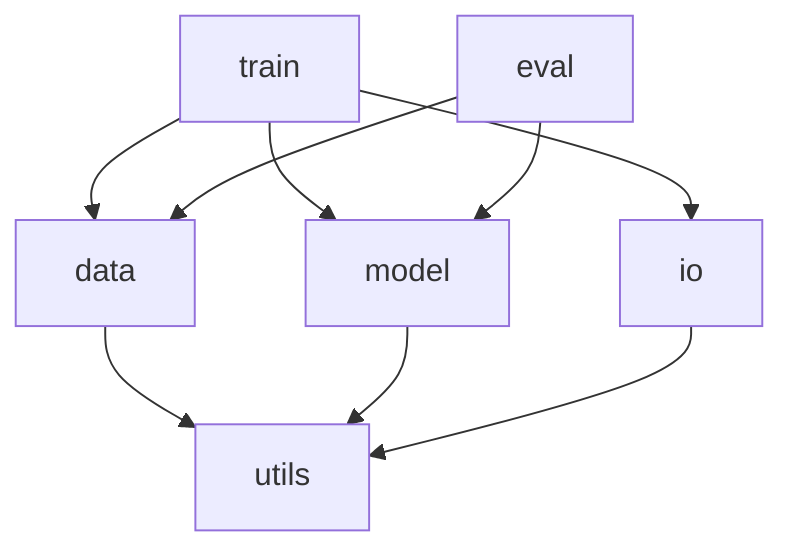

# ARCHITECTURE.md — 設計思想

設計原則・アーキテクチャ様式・採用パターンの集約。企業で標準的に使われる手法をベースに、研究コード向けに調整する。
設計判断は複数案から人間が選ぶ（AGENTS.md §2）。ここはその選択基準と記録でもある。

## Table of Contents
1. [Design Principles](#design-principles)
2. [Architectural Style Options（規模別 + 選択基準）](#architectural-style-options規模別--選択基準)
3. [Module Map](#module-map)
4. [Dependency Rules](#dependency-rules)
5. [Design Pattern Catalog](#design-pattern-catalog)
6. [Research-Specific Structures](#research-specific-structures)
7. [Anti-Patterns & Anti-Over-Engineering](#anti-patterns--anti-over-engineering)
8. [References](#references)

---

## Design Principles

企業現場で土台になる原則。**まず原則、パターンは結果**（パターンは原則を満たす手段にすぎない）。

### SOLID

| 原則 | 意味 | 研究コードでの例 |
|------|------|------|
| **S**RP（単一責任） | 1 クラス/関数は 1 つの理由でだけ変わる | データ読込・前処理・学習を 1 関数に詰めない |
| **O**CP（開放閉鎖） | 拡張に開き、変更に閉じる | 新しい損失を**追加**で足せる（既存を書き換えない） |
| **L**SP（リスコフ置換） | 派生は基底と差し替え可能 | `Sampler` の実装はどれも同じ契約を満たす |
| **I**SP（インターフェース分離） | 使わないメソッドに依存させない | 巨大な `Model` 抽象より小さい役割別 IF |
| **D**IP（依存性逆転） | 上位は抽象に依存、詳細が抽象に従う | 学習ループは具体ロガーでなく `Logger` 抽象に依存 |

### その他の基本原則

- **Separation of Concerns（関心の分離）**: I/O・数値計算の核・実験オーケストレーションを混ぜない。
- **High Cohesion / Low Coupling（高凝集・低結合）**: 関係するものは近く、依存は最小に。
- **Composition over Inheritance（継承より合成）**: 振る舞いは部品の組合せで（深い継承木を避ける）。
- **DRY**: 知識の重複を避ける（ただし早すぎる共通化はしない、下記 Rule of Three）。
- **KISS / YAGNI**: 単純に保ち、必要になるまで作らない。研究は要件が動くため特に重要。
- **Law of Demeter（最小知識）**: `a.b().c().d()` のような深い連鎖を避ける。
- **Rule of Three**: 同じパターンが 3 回出たら抽象化（2 回までは重複を許容）。

---

## Architectural Style Options（規模別 + 選択基準）

企業では「単純に始めて、必要に応じて発展させる」が定石。最初から大げさにしない。

| 規模 | 様式 | 概要 | 適する場面 | コスト |
|------|------|------|------|------|
| 小 | スクリプト + 関数 | 関数中心、クラス最小 | 試作・単発・個人 | 大きくなると分岐・状態が散る |
| 中 | レイヤード / モジュール分割 | `data`/`model`/`train`/`eval` 等で責務分割、依存方向を固定 | 継続開発・研究本体 | 層の初期設計 |
| 大 | ヘキサゴナル（Ports & Adapters）/ クリーン | 核（ドメイン・数値計算）を中心に、外部 I/O をアダプタで外付け。依存は内向き | 長期・多人数・手法比較基盤・多数の外部連携 | 間接層が増え追いにくい |
| 特大 | + DDD（戦術パターン） | ドメインが本質的に複雑なとき、Entity/ValueObject/Repository 等で表現 | 業務ロジックが複雑な場合 | 学習・設計コストが高い |

### 選択基準（簡易フローチャート）

```
業務/ドメインロジックは単純?
  └ YES → レイヤード（安全な既定）
  └ NO  → 外部連携が多い?
            └ YES → ヘキサゴナル（Ports & Adapters）
            └ NO  → ドメインが本質的に複雑?
                      └ YES → DDD + ヘキサゴナル
                      └ NO  → クリーンアーキテクチャ
```

実務上の指針：
- **段階導入**: 全部に DDD を適用しない。最も複雑なモジュールから始める。
- **混在 OK**: 1 システム内で核は DDD/ヘキサゴナル、周辺はレイヤード、と使い分ける。
- **チーム力に合わせる**: 理解できる範囲の様式を選ぶ（過度な抽象は害）。
- **YAGNI**: まだ要らない抽象は作らない。

> 採用: {{小/中/大/特大}} / 理由: {{...}}（変わったら追記）

---

## Module Map

<!-- TODO: 各モジュールの責務と依存を埋める -->

| モジュール | 責務 | 依存してよい先 |
|------|------|------|
| `data` | 読み込み・前処理 | `utils` |
| `model` | モデル定義（数値計算の核） | `utils` |
| `train` | 学習ループ（オーケストレーション） | `data`,`model`,`utils` |
| `eval` | 評価・指標 | `data`,`model`,`utils` |
| `io`（adapters） | ロガー・ストレージ・データ源のラッパ | `utils` |
| `utils` | 共通の小道具 | （なし） |



---

## Dependency Rules

- **依存は内向き・一方向**（DIP）。核（`model` の数値計算）は外部（`io`）に依存しない。`utils` は最下層で何にも依存しない。
- **循環依存は禁止** → 生じたら共通部分を下層へ抽出する。
- **外部ライブラリは Adapter に閉じ込める**。核から具体ライブラリ（特定の DL フレームワーク・クラウド SDK）を直接呼ばない。差し替え・テストのモック化が容易になる。
- **抽象の境界 = テストの境界**。差し替えたい箇所に抽象（ポート）を置く。

---

## Design Pattern Catalog

GoF の 3 分類で整理（Factory はその一例にすぎない）。**まず素朴に書き、重複・分岐の散在・テスト困難が見えてから**入れる。採用時は理由を 1〜3 文添える（AGENTS.md §4）。

### Creational（生成）

| パターン | いつ使う | 研究コードでの例 |
|------|------|------|
| Factory Method | 設定名から実装を生成。`if name==...` が散る前 | `make_optimizer("adam", ...)` |
| Abstract Factory | 関連する一群（モデル+前処理+評価）をまとめて生成 | データセット種別ごとの部品一式 |
| Builder | 引数が多い設定を段階的に組む | 実験 `Config` の構築 |
| Registry | 手法を多数比較し、登録で増やす（中央分岐を編集しない） | `@register("my_model")` |
| Singleton（要注意） | グローバル唯一が本当に必要なときだけ | デバイス/設定の単一ハンドル（乱用しない） |

### Structural（構造）

| パターン | いつ使う | 研究コードでの例 |
|------|------|------|
| Adapter | 外部ライブラリを核から隔離 | クラウドストレージ/ロガーのラッパ |
| Facade | 複雑なサブシステムに単純な窓口 | `pipeline.run()` 一発で前処理〜評価 |
| Decorator | 既存に振る舞いを積み増す | データ拡張・キャッシュ・計測の付加 |
| Composite | 木構造を一様に扱う | 変換の入れ子（`Compose([...])`） |

### Behavioral（振る舞い）

| パターン | いつ使う | 研究コードでの例 |
|------|------|------|
| Strategy | 同一 IF で中身を差し替え | 損失/サンプラ/スケジューラの切替 |
| Template Method | 骨格は固定、一部だけ差し替え | 学習ループの雛形＋フックで拡張 |
| Observer | 状態変化を購読者へ通知 | 学習中のメトリクスを各ロガーへ配信 |
| Command | 操作をオブジェクト化 | 実験ジョブのキュー・再実行 |
| State | 状態ごとに振る舞いを変える | 学習/検証/早期終了のフェーズ管理 |

最小の実例（Strategy: 学習ループを変えずに損失を差し替える）:

```python
class Loss(Protocol):
    def __call__(self, pred, target): ...

def train_step(batch, model, loss_fn: Loss):
    pred = model(batch.x)
    return loss_fn(pred, batch.y)   # 損失の中身に依存しない

# 呼び出し側が戦略を選ぶ
loss_fn = make_loss("cross_entropy")   # Factory で生成（生成と利用を分離）
```

---

## Research-Specific Structures

研究ソフトは**再現性**が品質の中心。一般のアーキに加えて次を設計に織り込む。

- **核と周辺の分離**: 「数値計算の核（再現性が要る）」と「実験オーケストレーション（試行錯誤する）」を分け、核を薄く・純粋に保つ。
- **Typed Config**: ハイパラは `@dataclass` 等の型付き設定 or YAML/TOML に集約（直書きを散らさない）。Builder/Config パターン。
- **Registry で手法を差し替え**: モデル・損失・データを名前で登録し、設定から引く（比較実験に直結）。
- **Pipeline / DAG**: 前処理→学習→評価を段階化し、各段の入出力を明示。途中成果をキャッシュ。
- **Repository for artifacts**: データ・チェックポイントの保存先（local/S3/DB）を抽象化し、I/O を 1 箇所に隔離。
- **Provenance / 再現性の記録**（必須）: 各実行で **commit hash・seed・環境（CPU/GPU/メモリ・主要ライブラリ版）・設定** を残す。Infrastructure-as-Code や環境固定（lock ファイル/コンテナ）で「同じ条件で再実行」を担保。詳細記録は `docs/EXPERIMENTS.md`。
- **決定性の確保**: 乱数源（フレームワーク・データローダ・GPU 非決定演算）を seed で固定。固定できない箇所は明記。

---

## Anti-Patterns & Anti-Over-Engineering

避けるべき型と、やり過ぎの抑制。

### よくあるアンチパターン
- **God Object / God Function**: 何でも知っている巨大クラス・関数（SRP 違反）。
- **Anemic Domain Model**: データだけ持ち振る舞いがどこにもない（ロジックが各所に散る）。研究では「設定オブジェクトに計算が漏れる」形で出やすい。
- **Premature Abstraction**: 使われていない一般化。研究の高速な要件変化と相性が悪い。
- **Hidden Global State**: 暗黙のグローバル状態（再現性・テスト性を壊す）。

### やり過ぎを抑える（研究では害が大きい）
- パターンは**痛みが出てから**入れる（重複・分岐散在・テスト困難）。
- 抽象は **Rule of Three**。1〜2 回なら重複のまま。
- 1 段の間接で足りるなら 2 段重ねない。
- 「将来こう拡張するかも」だけを根拠に抽象化しない（YAGNI）。
- 迷ったら AGENTS.md §2 に従い、**素朴案 vs 抽象案**を並べて人間に選ばせる。

---

## References

設計判断の出典（人間が確認のうえ参照）。

- R. C. Martin, *Clean Architecture* (2017) / *Clean Code* (2008) — SOLID・依存の向き
- E. Evans, *Domain-Driven Design* (2003) / V. Vernon, *Implementing DDD* (2013) — ドメインモデリング
- M. Fowler, *Patterns of Enterprise Application Architecture* (2002) — 企業アプリのパターン
- GoF, *Design Patterns* (1994) — 生成/構造/振る舞いの古典パターン
- A. Cockburn, *Hexagonal Architecture (Ports & Adapters)* — 核の隔離
- *The Turing Way* / Better Scientific Software — 研究ソフトの再現性・持続可能性
